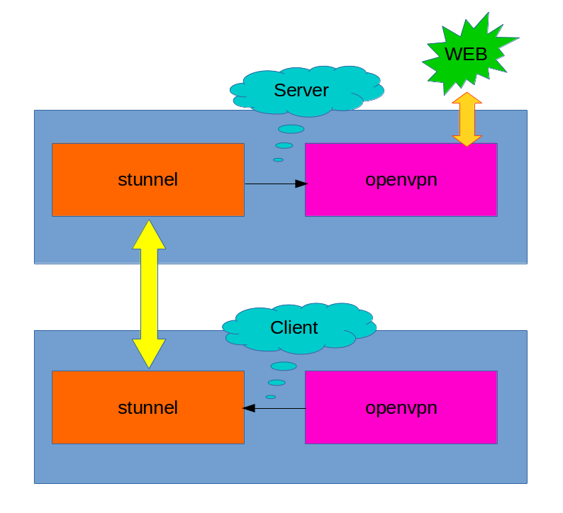

# stunnel
Hiding [openvpn](https://en.wikipedia.org/wiki/OpenVPN) traffic with stunnel so [DPI](https://en.wikipedia.org/wiki/Deep_packet_inspection) firewalls are less likely to block your traffic.

# Concept



As you see in the above diagram, trafic encapsulates as `SSL/TLS` by `stunnel` regradless of it's internal protocol. Since we need `SSL/TLS` handshake, if `openvpn` in the underlying protocol we need to use `TCP` protocol for `openvpn`.
You can find a simple tutorial for installing `openvpn` on a debian machine [here](https://github.com/Xaqron/openvpn).
Supposing you already have installed `openvpn` over `TCP 1194` on your server, then you need to hide the trafiic via [stunnel](https://www.stunnel.org) and this tutorials will guide you trough the rest of procedures.
This has two steps:
1) Install and configure `stunnel` on server.
2) Install and configure `stunnel` on client.

In reality `SSL/TLS` traffic is short and intermittent so still it would be easy for a goverment/ISP to detect `stunnel` since lots of traffic will be passed as `SSL/TLS`. It is recommended to use port `TCP 443` or `TCP 587` to hide the traffic so far.

# Install and configure `stunnel` on server

You can run the script `stunnel.sh` provided by this tutorial like:
```bash
sudo bash stunnel.sh
```
download `stunnel.pem` from your home directory after installation got completed.
Now step two is configuring client side.

# Install and configure `stunnel` on client

You should have a `client.ovpn` config file or something similar for connecting to openvpn server.
Edit this file and add the following lins at the begining:

```bash
script-security 2
up /etc/openvpn/update-resolv-conf
down /etc/openvpn/update-resolv-conf

route server_ip 255.255.255.255 net_gateway
```

Replace `server_ip` with your server public IP address.

## Install stunnel

```bash
sudo apt install stunnel4
```

## Copy pem file from server installation to the client

```bash
sudo cp ./stunnel.pem /etc/stunnel
```

## Configuring stunnel

Create `/etc/stunnel/stunnel.conf` file with the following content:

```bash
[openvpn]
client = yes
accept = 1194
connect = server_ip:443
cert = /etc/stunnel/stunnel.pem
```

Replace `server_ip` with your server public IP address. Here we used port `443`

## Configuring firewall

```bash
sudo iptables -A INPUT -p tcp -s localhost --dport 1194 -j ACCEPT
sudo iptables -A INPUT -p tcp --dport 1194 -j DROP
```

## Restart stunnel service

```bash
sudo service stunnel4 restart
```

## Connecting

Now you just connect to openvpn via its' config file and it will automatically route traffic via stunnel. Your local stunnel will connect to remote stunnel on the server which routes received trsffic to oprnvpn service.

Example:

```bash
sudo openvpn --config client.ovpn
```

Everything should work well by now.

[Contact Me](https://twitter.com/xaqron)